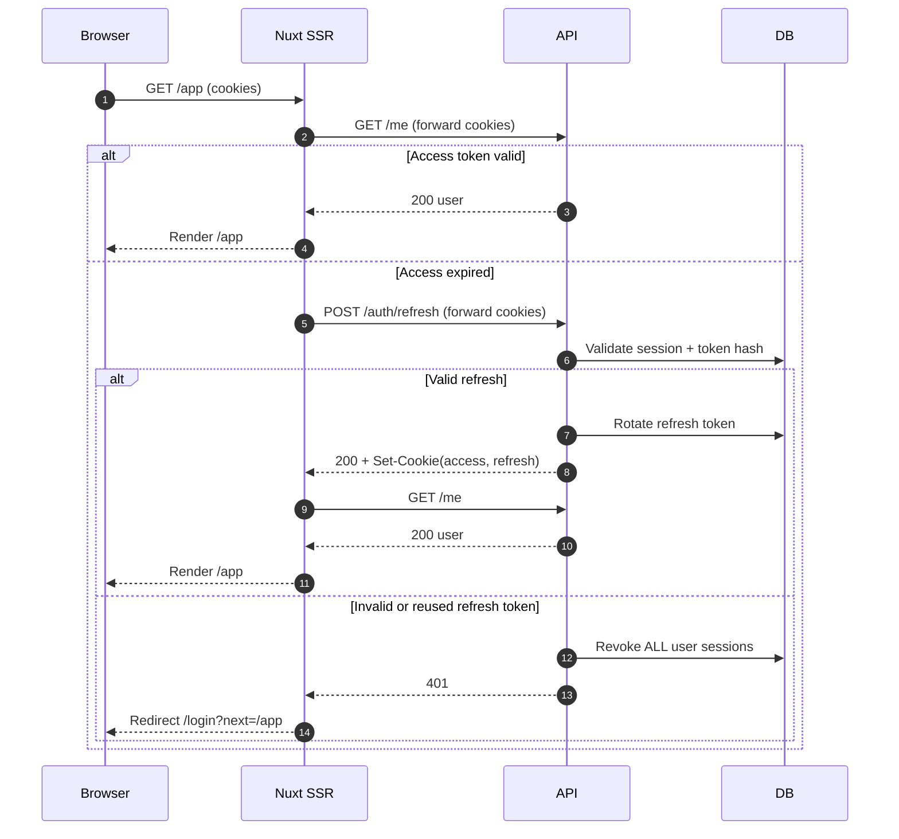
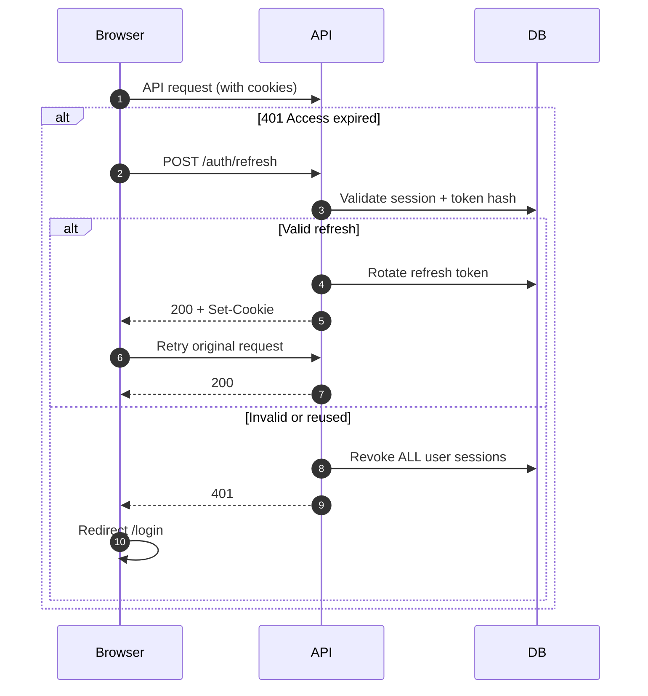
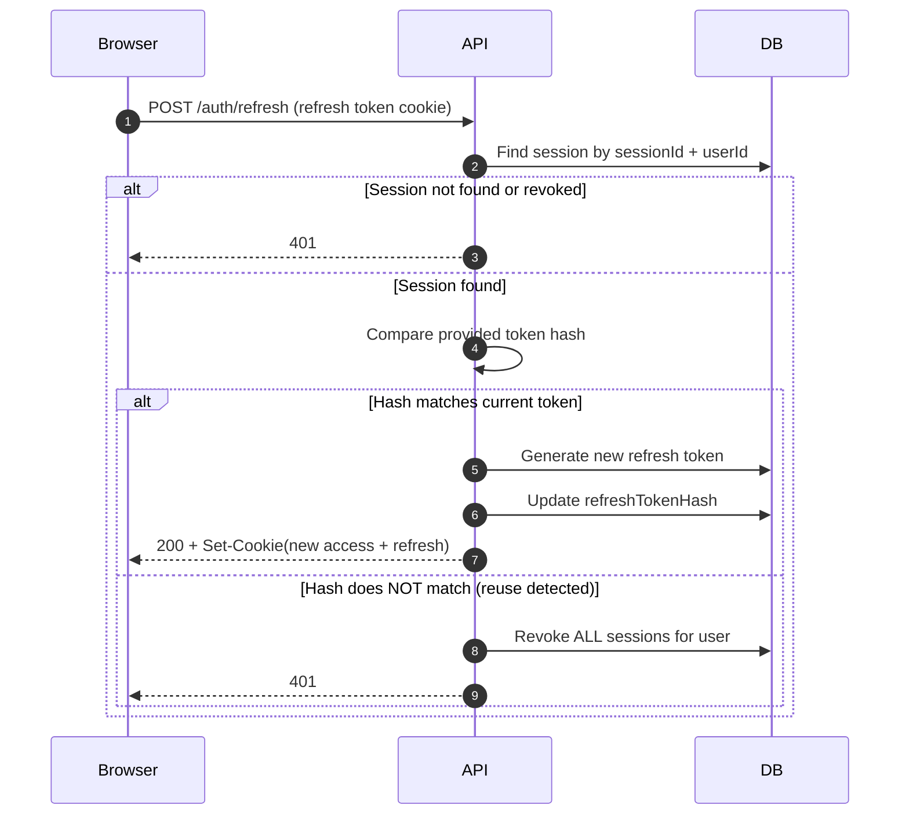
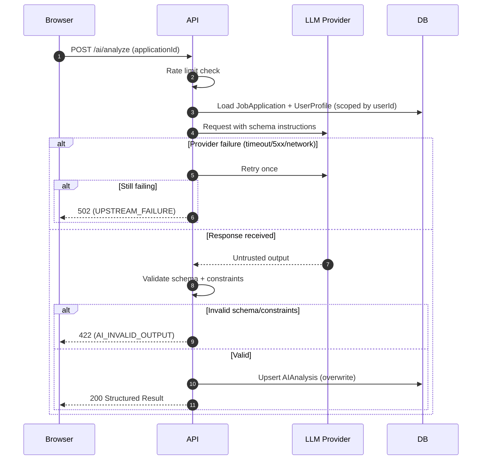
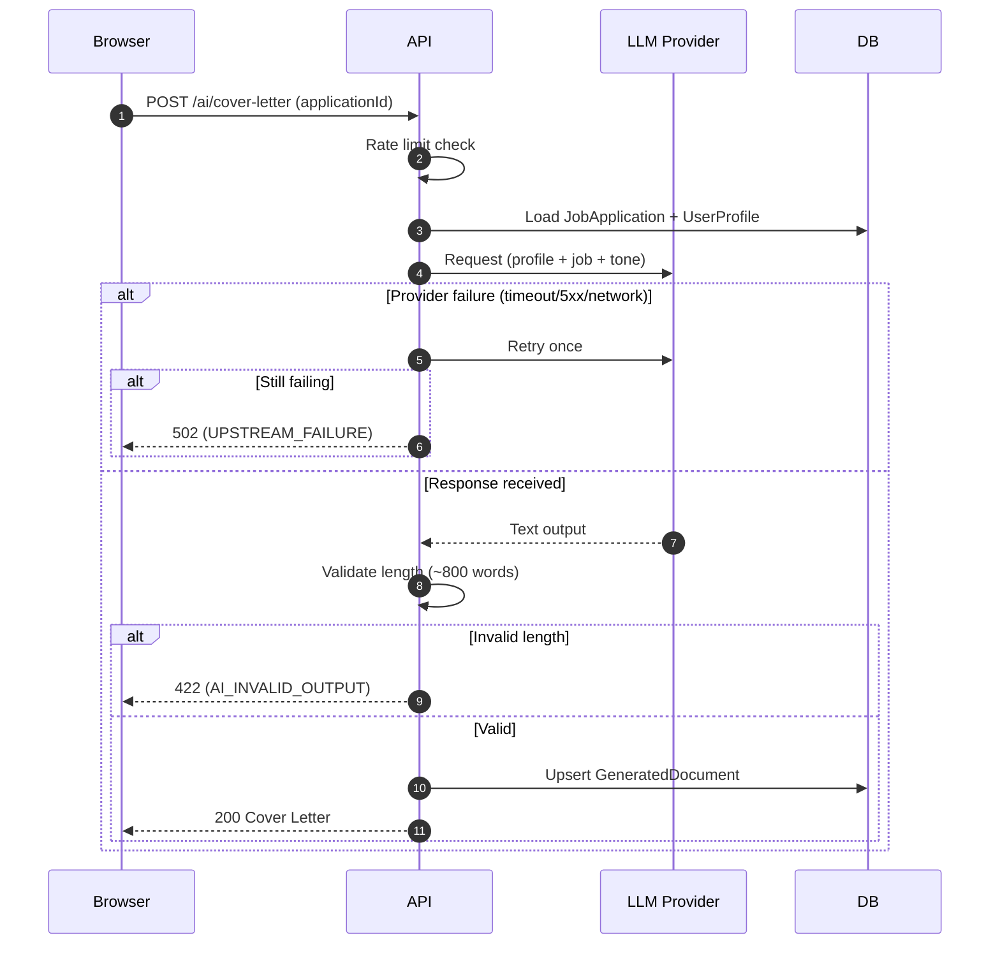

# ApplyHarbor — Technical Specification (MVP v1)

---

## 1. Purpose

ApplyHarbor is an AI-powered job application management platform designed to:

- Demonstrate production-grade authentication architecture.
- Showcase secure refresh token rotation with reuse detection.
- Enforce strict ownership and validation guarantees.
- Integrate AI safely with structured validation and controlled failure handling.
- Serve as a portfolio-grade backend/frontend system.

Primary objective of MVP v1:
Deliver a technically rigorous system that signals architectural maturity, security awareness, quantified rate limiting, strict validation, and disciplined testing.

Explicitly out of scope (v1):

- Password reset
- Email verification
- Billing / Stripe
- CV upload & parsing

---

## 2. Product Scope (MVP v1)

Users can:

- Manage job applications in a structured pipeline.
- Analyze job fit using AI (strictly validated structured output).
- Generate a cover letter based on their professional profile.

Architectural robustness is prioritized over feature breadth.

---

## 3. Routing Model

### 3.1 Public (SSR)

`/` — Single scrollable landing page with anchor sections:

- Product
- How it works
- Features
- Pricing
- Roadmap
- Privacy
- Terms

### 3.2 Public Authentication

- `/login`
- `/register`

If authenticated → redirect to `/app`.

### 3.3 Private Application

`/app/**`

Requirements:

- SSR protection
- Client-side navigation protection
- Attempt refresh before redirect if access expired
- If unauthenticated → redirect to `/login?next=<originalPath>`

Implementation details for SSR gating and client refresh behavior are defined in **Section 16 (Frontend Architecture)** and must match Diagrams 15.1 and 15.2.

---

## 4. Technical Stack

- Frontend: Nuxt 3 (Vue 3 + TypeScript) + Tailwind
- Backend: Node.js + Fastify + TypeScript
- Database: PostgreSQL + Prisma
- Authentication: HttpOnly cookies (Access + Refresh)
- API Style: REST
- Deployment: Vercel (web) + Railway (API + DB)

---

## 5. Cookies, CORS, and Environments

### Local Development

- Frontend: http://localhost:3000
- API: http://localhost:4000
- HttpOnly: true
- Secure: false
- SameSite: Lax

### Production (Cross-Site)

- Frontend: https://your-domain.com
- API: https://your-api.railway.app
- HttpOnly: true
- Secure: true
- SameSite: None
- CORS: exact origin
- credentials: true

### Checklist

- All authenticated frontend requests use `credentials: 'include'`
- API CORS configured with `credentials: true`
- Cookies configured correctly for cross-site
- No sensitive tokens exposed to JS
- All API calls must use the centralized frontend API layer (Section 16)

---

## 6. Authentication Architecture

### 6.1 Token Model

- Access token: 10–15 minutes
- Refresh token: 7–30 days
- Refresh tokens stored hashed in DB
- Multiple concurrent sessions allowed (multi-device)
- Logout revokes the session

### 6.2 Refresh Rotation & Reuse Detection

On refresh:

1. Resolve session using the session identifier from the refresh token (or paired cookie data).
2. Validate session exists, is not revoked (`revokedAt IS NULL`), and is not expired (`expiresAt > now`).
3. Validate the provided refresh token hash matches the stored `refreshTokenHash`.
4. Rotate refresh token (generate new refresh token + update `refreshTokenHash`), and issue new access + refresh cookies.

If a previously rotated refresh token is reused (hash mismatch for an existing, non-revoked session):

- Treat as a security event.
- Revoke **ALL active sessions** for the user (set `revokedAt` for all).
- Return 401.

### 6.3 Auth Endpoints

See Section 10 (API Surface) for full endpoint list.

---

### 6.4 Refresh Token Structure

- Refresh tokens are opaque tokens.
- Each refresh token is associated with a specific Session record.
- The refresh token contains (or is paired with) a session identifier used to locate the session in the database.
- The API must always resolve the session before validating the token hash.

---

### 6.5 Security Assumptions

- Access and refresh tokens are delivered exclusively via HttpOnly cookies.
- Tokens are never exposed to JavaScript and are not stored in localStorage or sessionStorage.
- CSRF risk is mitigated via SameSite configuration and strict CORS origin matching.

---

## 7. Core Domain Features

### 7.1 User Profile

Editable at `/app/settings`

Fields:

- professionalSummary (max 1500)
- keySkills (max 1000)
- tonePreference (PROFESSIONAL | DIRECT | FRIENDLY)

### 7.2 Job Applications

Full CRUD with pagination, filtering, and search.

Ownership enforcement required:

```ts
where: {
  id: applicationId,
  userId: currentUser.id
}
```

If not found under scoped query → return 404.

Enum:

```ts
enum ApplicationStatus {
  SAVED
  APPLIED
  INTERVIEW
  OFFER
  REJECTED
  WITHDRAWN
}
```

### 7.3 Dashboard

Backend-driven calculations:

- Count per status
- Needs attention:
  - APPLIED not updated in 14+ days
  - nextStepAt within 7 days

---

## 8. AI Integration

### 8.1 Job Analysis

Constraints:

- summary ≤ 500 chars
- arrays ≤ 10 items
- matchScore 0–100
- Strict schema validation
- Overwrite on regenerate

### 8.2 Cover Letter

- Plain text ≤ ~800 words
- Overwrite behavior

### 8.3 Validation Strategy

- Fastify JSON schemas validate HTTP inputs/outputs
- AI responses validated separately using Zod
- AI treated as untrusted input

### 8.4 AI Failure Handling

Provider failure (timeout/5xx/network):

- Retry once
- If still failing → 502 (UPSTREAM_FAILURE)

Schema/constraint failure:

- Do not retry
- Return 422 (AI_INVALID_OUTPUT)

Only successful validated outputs are persisted.
Production logs store metadata only.

---

## 9. Data Model

### User

- id
- email (unique)
- passwordHash
- plan (FREE | PRO) default FREE
- createdAt

### Session

- id
- userId
- refreshTokenHash
- expiresAt
- revokedAt
- createdAt

### UserProfile

- id
- userId (unique)
- professionalSummary
- keySkills
- tonePreference

### JobApplication

- id
- userId
- companyName
- roleTitle
- jobUrl
- status
- notes
- jobDescription
- nextStepAt
- createdAt
- updatedAt

### AIAnalysis

- id
- applicationId (unique)
- summary
- mustHaveSkills
- niceToHaveSkills
- matchScore
- profileGaps
- improvementSuggestions
- createdAt

### GeneratedDocument

- id
- applicationId
- type (COVER_LETTER)
- content
- createdAt

---

## 10. API Surface

### Auth

- POST /auth/register
- POST /auth/login
- POST /auth/refresh
- POST /auth/logout
- GET /me

### Applications

- GET /applications
- POST /applications
- GET /applications/:id
- PATCH /applications/:id
- DELETE /applications/:id

### Profile

- GET /profile
- PUT /profile

### AI

- POST /ai/analyze
- POST /ai/cover-letter

---

## 11. Rate Limiting Policy (MVP v1)

Implementation:

- In-memory
- Fixed window per minute
- Daily quotas reset at UTC midnight
- Centralized config

### Auth

- login: 5/min per IP + 10/min per email
- register: 3/hour per IP
- refresh: 30/min per user
- logout: 30/min per user

### Core CRUD

- applications: 120/min per user
- profile: 60/min per user
- /me: 120/min per user

### AI

- analyze: 5/min + 20/day per user
- cover-letter: 3/min + 10/day per user

---

## 12. API Error Contract

All API errors return:

```json
{ "error": "ERROR_CODE", "message": "Human readable message" }
```

Codes:

- UNAUTHORIZED
- FORBIDDEN
- NOT_FOUND
- VALIDATION_ERROR
- RATE_LIMITED
- AI_INVALID_OUTPUT
- UPSTREAM_FAILURE

Frontend error mapping policy is defined in **Section 16 (Frontend Architecture)**.

---

## 13. Testing Strategy

### Tooling

- Vitest (unit)
- Supertest (integration)
- Playwright (E2E)
- Separate test database

### Unit

- Password hashing
- Refresh rotation
- Reuse detection
- Dashboard logic
- AI validation

### Integration

- Full auth flow
- Refresh rotation + reuse handling
- Logout invalidation
- Ownership enforcement
- AI 422/502 behavior
- Rate limiting enforcement

### E2E (Happy Path)

1. Register
2. Login
3. Create application
4. Trigger AI analysis
5. Validate structured result renders

CI must:

- Install dependencies
- Run tests
- Fail on lint errors

---

## 14. Definition of Done

- Full flow works in production
- Refresh rotation stable
- Reuse detection implemented
- AI schema validation enforced
- Rate limits enforced
- Tests passing in CI
- No TODO/FIXME in production code paths
- Clean README with architectural explanations

---

## 15. Diagrams

### 15.1 SSR Authentication Flow (Initial Page Load)



### 15.2 Client-Side Navigation (After Initial Load)



### 15.3 Dedicated Refresh Rotation & Reuse Detection



### 15.4 AI — Job Analysis Flow



### 15.5 AI — Cover Letter Flow



## 16. Frontend Architecture

### 16.1 Goals

- Keep frontend maintainable via clear domain boundaries (no “everything everywhere” structure).
- Ensure SSR + client navigation auth behavior matches the backend auth design and **Diagrams 15.1 and 15.2**.
- Centralize API calls, error mapping, and auth refresh behavior.
- Avoid premature frontend overengineering (keep MVP lean and readable).

---

### 16.2 Folder & Module Structure (Domain-First, Minimal)

Organize by product domains (features), with shared UI separated.

Recommended structure:

- `pages/` — Nuxt routing only (thin pages, compose domain modules)
- `features/`
  - `auth/` — route protection helpers, session state, refresh handling
  - `applications/` — CRUD UI, domain composables, API client, types
  - `profile/` — settings UI, API client, types
  - `ai/` — analyze/cover-letter actions, rendering helpers, API client, types
- `components/ui/` — dumb reusable UI primitives (buttons, inputs, modal, etc.)
- `lib/` — generic helpers (date formatting, small utilities)

Rule: domain logic stays inside `features/<domain>/`. Pages assemble domains; they do not own business logic.

---

### 16.3 API Access Strategy (Centralized per Domain)

No direct `$fetch` calls scattered across pages/components.

Each domain exports a small typed API client:

- `features/auth/api.ts`
- `features/applications/api.ts`
- `features/profile/api.ts`
- `features/ai/api.ts`

All authenticated requests MUST include credentials (cookies):

- `credentials: 'include'`

Optional shared wrapper:

- `lib/apiFetch.ts` to enforce `credentials`, map errors, and support retry logic.

---

### 16.4 Auth in Frontend (SSR + Client)

#### 16.4.1 `/me` as source of truth

`GET /me` is the canonical “who am I?” endpoint:

- `200` => authenticated + returns user
- `401` => unauthenticated / session invalid

Frontend uses `/me` for:

- SSR gating on `/app/**`
- client re-hydration of current user
- verifying auth after refresh

#### 16.4.2 SSR protection for `/app/**`

On initial page load for `/app/**`:

1. Nuxt SSR calls `GET /me` forwarding cookies.
2. If `200`, render.
3. If `401`, SSR calls `POST /auth/refresh` (forward cookies).
4. If refresh succeeds, call `GET /me` again and render.
5. If refresh fails, redirect to `/login?next=<originalPath>`.

#### 16.4.3 Client-side refresh & retry

On client API calls:

- If an API call returns `401`, attempt `POST /auth/refresh` once, then retry the original request.
- Must implement **single-flight refresh** (prevent multiple refresh calls in parallel).
- If refresh fails, redirect to `/login`.

#### 16.4.4 Refresh concurrency (Single-Flight Requirement)

Client-side refresh MUST be single-flight to avoid refresh storms:

- If multiple requests receive `401` concurrently, the client must perform only ONE refresh request.
- While refresh is in progress, other requests must wait for the same refresh result.
- After refresh succeeds, queued requests retry the original request at most ONCE.
- If refresh fails, queued requests must fail immediately and redirect the user to `/login`.
- Never attempt refresh if the failing request is itself `POST /auth/refresh`.
- The refresh request itself must never be retried automatically.

---

### 16.5 Data Fetching Policy (SSR-first, SPA feel)

- `/` (landing) is SSR.
- `/app/**` keeps SSR enabled for auth gating and fast initial render.
- After hydration, navigation is client-side as usual in Nuxt.

Data loading policy:

- SSR-blocking fetch: only what is required for correct initial render (e.g., current user, minimal page data).
- Client/lazy fetch: secondary panels, non-critical widgets, AI outputs until user action triggers them.

---

### 16.6 Error & Loading UX (Standardized)

Frontend must use a consistent error handling policy based on the API error contract.

Mappings:

- `401 UNAUTHORIZED`: attempt refresh (client), otherwise redirect to login.
- `429 RATE_LIMITED`: show a clear UI message; disable the triggering action temporarily if appropriate.
- `422 AI_INVALID_OUTPUT`: show a “try again” UX; do not treat as generic failure.
- `502 UPSTREAM_FAILURE`: show provider-unavailable message; allow retry.

Loading policy:

- Use consistent loading states (skeletons for lists, spinners for small actions).
- Provide empty states for: no applications, no profile yet, no AI analysis yet.

---

### 16.7 Forms & Validation

- MVP uses minimal client-side validation for UX (required fields, basic length constraints).
- Backend schema validation is authoritative (Fastify JSON schema).
- AI responses are never trusted; they are validated server-side and only then displayed.

---

### 16.8 Decision Log (Re-evaluate Later)

The following MVP decisions are intentional defaults and may be revisited after implementing 2–3 vertical slices:

- Domain-first structure (avoid scattered logic).
- Domain API clients (avoid scattered `$fetch` and inconsistent error handling).
- SSR gating + client refresh retry (avoid auth flicker and align with diagrams).
- Minimal client validation (avoid form library time sink in MVP).

---

## 17. Phase 2 (Optional)

### GraphQL (Demonstration Layer)

Optional showcase. Must not replace REST MVP.

### Plans

FREE:

- Manual profile
- Standard limits

PRO:

- Higher AI limits
- Advanced insights
- CV → Profile import (requires upload + parsing; excluded from MVP v1)
